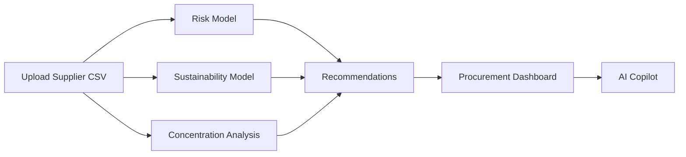

# SupplyLens

<p align="center">
  <strong>AI-Powered Procurement Analytics & Supplier Risk Intelligence</strong>
</p>

<p align="center">
  Analyze supplier risk, concentration, sustainability, and procurement performance through an interactive dashboard powered by Python, Streamlit, and Generative AI.
</p>

---

## Live Demo

🔗 **Application:** <https://supplylens-ctoxjbxiqzgsqdptvh96zg.streamlit.app/>

---

## Overview

SupplyLens is an analytics platform designed to help procurement professionals identify supplier risks before they become supply chain disruptions.

It is intended for sourcing, procurement, and supply chain professionals who need a fast, explainable way to evaluate supplier performance and make data-driven sourcing decisions.

The application combines deterministic procurement analytics with generative AI to transform supplier data into actionable business insights.

Rather than relying solely on AI to make decisions, SupplyLens uses transparent, rule-based scoring models for supplier evaluation while leveraging Large Language Models (LLMs) to explain results in plain English.

This project was built to demonstrate skills in:

- Supply Chain Analytics
- Sustainability Analytics
- Python Development
- Data Visualization
- AI Integration
- Business Intelligence Dashboards

---

## Key Capabilities

- Supplier Risk Assessment
- Sustainability Scoring
- Category HHI & Supplier Concentration Analysis
- AI-Assisted Procurement Copilot
- Rule-Based Procurement Recommendations
- Interactive Spend Analytics

---

## Features

### Supplier Risk Scoring

Calculates a weighted supplier risk score (0–100) using:

- On-Time Delivery
- Defect Rate
- Lead Time
- Geographic Risk
- Backup Supplier Availability

Risk levels:

| Score | Classification |
|-------:|---------------|
| 0–20 | Very Low |
| 20–40 | Low / Moderate |
| 40–70 | Moderate / High |
| 70–100 | High / Critical |

---

### Supply Concentration Analysis

Measures procurement dependency through:

- Supplier Share %
- Category-level Herfindahl-Hirschman Index (HHI)
- Concentration Risk Levels

Categories are automatically flagged when supplier dependency exceeds recommended thresholds.

---

### Sustainability Assessment

Calculates a weighted sustainability score using:

- Sustainability Certifications
- Ethical/Recycled Materials
- Geographic Shipping Proxy
- Sustainability Policy Weighting

---

### Procurement Dashboard

Interactive dashboard including:

- Procurement Overview
- Key Insights
- Critical Risk Suppliers
- Sustainability Watchlist
- Category Concentration
- Supplier Overview
- Spend Visualization

---

### Rule-Based Procurement Recommendations

Automatically generates recommendations such as:

- Qualify Secondary Supplier
- Develop Contingency Sourcing Plan
- Initiate Supplier Performance Review
- Prioritize Sustainability Review
- Diversify Supplier Base

---

### AI Copilot

Powered by the Groq API.

The AI assists with:

- Executive Procurement Briefs
- Supplier Explanations
- Procurement Scenario Analysis

> **Important:** All supplier scores are calculated using deterministic procurement models. AI is used exclusively to summarize, explain, and interpret the results—it never calculates supplier risk or makes procurement decisions.

---

## Dashboard

```
Procurement Overview

+------------------+------------------+------------------+------------------+
| Avg Risk Score   | Avg Sustainability| High Risk %      | Avg Category HHI |
+------------------+------------------+------------------+------------------+

Key Insight

Critical Risks

Sustainability Watchlist

Category Concentration

Supplier Overview

Spend by Supplier
```

---

## How It Works



---

## Risk Scoring Methodology

Overall supplier risk is calculated using weighted procurement metrics.

| Component | Weight |
|-----------|-------:|
| Delivery Performance | 35% |
| Quality (Defect Rate) | 20% |
| Lead Time | 15% |
| Geographic Risk | 15% |
| Backup Supplier Availability | 15% |

Example delivery scoring:

| On-Time Delivery | Risk Score |
|-----------------|-----------:|
| ≥95% | 10 |
| 90–94% | 35 |
| 85–89% | 65 |
| <85% | 90 |

---

## Concentration Analysis

Supplier dependency is measured using two approaches.

### Supplier Share

```
Supplier Share =
Supplier Spend
---------------
Total Category Spend
```

Thresholds:

| Share | Risk |
|-------:|------|
| <20% | Low |
| 20–35% | Medium |
| >35% | High |

---

### Category HHI

```
HHI = s₁² + s₂² + s₃² + ...
```

Interpretation:

| HHI | Risk |
|-----:|------|
| <1500 | Low |
| 1500–2500 | Moderate |
| >2500 | High |

---

## Sustainability Methodology

Weighted sustainability model.

| Factor | Weight |
|---------|-------:|
| Sustainability Certification | 35% |
| Ethical/Recycled Materials | 35% |
| Region Proxy | 20% |
| Sustainability Policy | 10% |

---

## Technology Stack

| Category | Technology |
|-----------|------------|
| Language | Python |
| Dashboard | Streamlit |
| Data Processing | Pandas |
| AI | Groq API |
| SDK | OpenAI Python SDK |
| Version Control | Git |
| Repository | GitHub |

---

## Installation

Clone the repository.

```bash
git clone https://github.com/arnavbabel/SupplyLens.git

cd SupplyLens
```

Create a virtual environment.

### Windows

```bash
python -m venv .venv

.venv\Scripts\activate
```

### macOS/Linux

```bash
python3 -m venv .venv

source .venv/bin/activate
```

Install dependencies.

```bash
pip install -r requirements.txt
```

---

## Environment Variables

Create a `.env` file.

```env
AI_API_KEY=your_groq_api_key

AI_BASE_URL=https://api.groq.com/openai/v1

AI_MODEL=llama-3.3-70b-versatile
```

---

## Running the Application

```bash
streamlit run app.py
```

After launching the application, upload `data/sample_suppliers.csv` to explore the dashboard with the included example dataset.

---

## Example CSV Schema

| Column |
|---------|
| Supplier Name |
| Category |
| Annual Spend |
| On-Time Delivery % |
| Defect Rate % |
| Lead Time (days) |
| Region |
| Backup Supplier Available? |
| Sustainability Certification? |
| Recycled / Ethical Material Indicator? |

> **Sample Data:** The repository includes `data/sample_suppliers.csv`, allowing the dashboard to be explored immediately without creating a custom dataset.

---

## Project Structure

```text
SupplyLens
│
├── app.py
├── requirements.txt
├── README.md
├── .gitignore
│
├── data/
│   └── sample_suppliers.csv
│
├── src/
│   ├── ai.py
│   ├── concentration.py
│   ├── recommendations.py
│   ├── risk_model.py
│   └── sustainability.py
│
└── docs/
```

---

## License

This project is licensed under the MIT License.